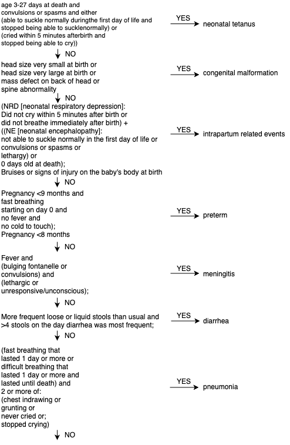
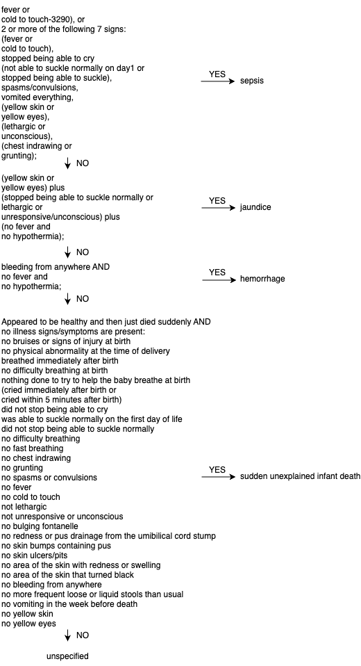
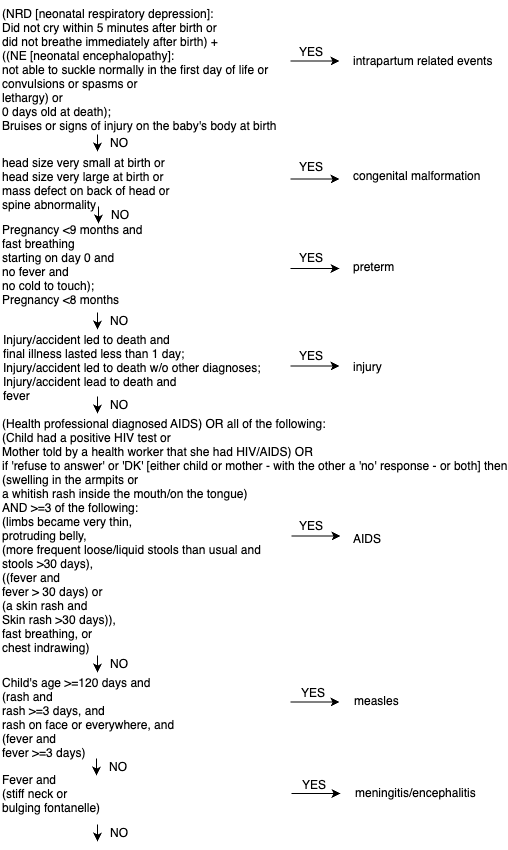
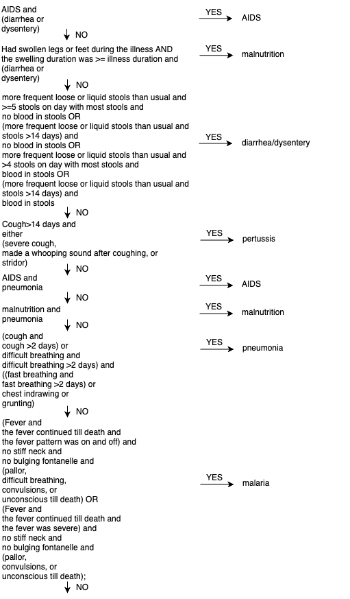
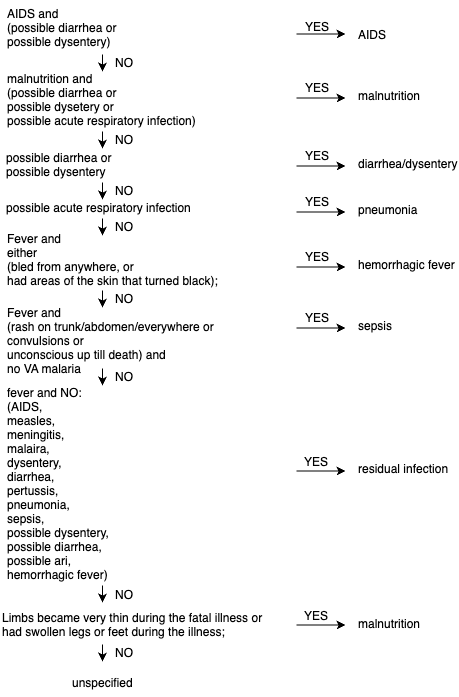

# Summary

EAVA (Expert Algorithm Verbal Autopsy) is an R package for determining cause of death (COD) using verbal autopsy (VA) 
interview questionnaire data, a predominant tool to determine cause of death in under-resourced settings [@VAinstrument]. The EAVA 
R package translates the methodology created and validated by Kalter and colleagues [@EAVA] to diagnose a cause of death from 
VA records of neonates and children (1 to 59 months of age). EAVA inputs data from the 2016 version of the WHO Verbal Autopsy 
(VA) questionnaire and outputs a cause of death (COD) for each VA record based on a deterministic hierarchy of causes. 
The assignment approach utilizes the decedent's age to decide which of two separate hierarchies will determine a cause of death.

# Statement of need

Most deaths occur outside of a medical setting and as a result, the causes of these deaths are not captured. Verbal
autopsies conducted in the community, usually at the homes of children who died, are used to understand the most common 
causes of death in settings where civil registration systems need to be strengthened [@WHO2016]. Physicians assess signs and 
symptoms, which were reported to be present at the time of death by a decedent’s caregiver during the Verbal Autopsy, 
and assign a cause of death deemed most likely. To account for bias, physician-coded verbal autopsy (PCVA) requires that 
verbal autopsy questionnaire data are read by multiple physicians. PCVA is time-intensive for physicians in resource-limited 
settings and repeatability can be low in childhood deaths [@hierarchy].

Over the last decade, there has been increased adoption of algorithmic cause-ascertainment from VA. These algorithms, 
termed as Computer-Coded Verbal Autopsy (CCVA), are considerably less time- and resource-intensive than PCVA, facilitating 
scalability of obtaining COD for large (national- or sub-national-level) VA databases. There now exists a suite of CCVA 
algorithms for COD ascertainment from VA data – EAVA, InterVA4, InterVA5, InSilicoVA, Tariff, and Naïve Bayes Classifier [@openVAtoolkit]. 
Each algorithm differs in implementation details and underlying methodology. However, except EAVA, most of these are primarily 
data-driven, estimating some form of a conditional probability symptom-given-cause matrix. These estimates are primarily derived 
from the Population Health Metrics Research Consortium (PHMRC) study, conducted in 2011, which contains both VA records and 
validated ‘gold-standard’ causes [@PHMRC]. Reliance on PHMRC limits generalizability in newer VA 
studies. It has been shown that most CCVA algorithms misclassify the cause for a substantial proportion of deaths [@transfer;@datashift].

EAVA addresses some of the drawbacks of physician coding and is not reliant on PHMRC data. It automates and replicates 
the decision trees of human physician coders as it assesses signs and symptoms of common causes of death, arriving at a 
single diagnosis using ICD-10 classifications in the hierarchy. If diagnostic criteria are not met for any cause, the neonate 
or 1-to-59-month-old child is assigned a COD of “unspecified” (Appendices 1 and 2). EAVA has been shown to yield comparable 
accuracy to the other CCVA algorithms [@singlecause;@multicause]. The COD outputs from EAVA can also be used in the VA calibration 
algorithm which combines COD ascertainment from multiple CCVA algorithms and adjusts for their biases to produce a calibrated estimate 
of population-level cause-specific mortality fractions [@transfer;@datashift;@heterogeneity]. Inclusion of CCVA algorithms with different cause-ascertainment logic 
ensures robustness of results for VA calibration. Hence, due to the fundamentally different decision-making nature of EAVA 
compared to other CCVA algorithms, it is now a central component of the VA calibration algorithm and has been used in 
VA-calibration to produce bias-corrected estimates of CSMF for child (1-59 months) and neonatal deaths in Mozambique [@singlecause;@multicause;@countrywide]

The EAVA R package takes EAVA analytical scripts originally compiled in SAS and R and makes the methodology publicly available 
in CRAN, which expands the potential for research use, ongoing development, and future integration into VA pipelines and toolkits.

# State of the field

Many of the aforementioned CCVA algorithms (EAVA, InterVA4, InterVA5, InSilicoVA, Tariff, and Naïve Bayes Classifier) are 
implemented in the openVA R package [@openVA]. The CrossVA package converts 2016 WHO VA questionnaire data to a standard input format 
for use in openVA [@CrossVA]. There is also standalone software for some CCVA algorithms, for example, the InterVA algorithm [@InterVA] and the SmartVA 
algorithm [@SmartVA]. There has been no publicly available version of EAVA prior to this R package.

# The EAVA package

The EAVA R package comprises two functions [@EAVAR]. The first function is odk2EAVA which builds on the CrossVA package to convert 
interview responses from the 2016 WHO Verbal Autopsy questionnaire into standardized inputs for use in codEAVA. The second function, 
codEAVA, evaluates whether reported symptoms meet diagnostic criteria of common causes of death and assigns a main cause based on a 
hierarchy of causes. The algorithm utilizes age-group specific ascertainment logic due to significant differences between the common 
causes of death of neonates 0-27 days (Appendix 1) and children aged 1-to-59-months (Appendix 2). 

# Acknowledgements

This work was supported by The Gates Foundation Grant INV-03484. We would like to thank the families who participated in VA interviews 
for the Countrywide Mortality Surveillance for Action project. 

\pagebreak

# Appendix 1: deterministic hierarchical algorithm to reach a single cause of death in neonates

\pagebreak

\pagebreak

# Appendix 2: deterministic hierarchical algorithm to reach a single cause of death in children 1-to-59-months-of-age

\pagebreak

\pagebreak

# References

